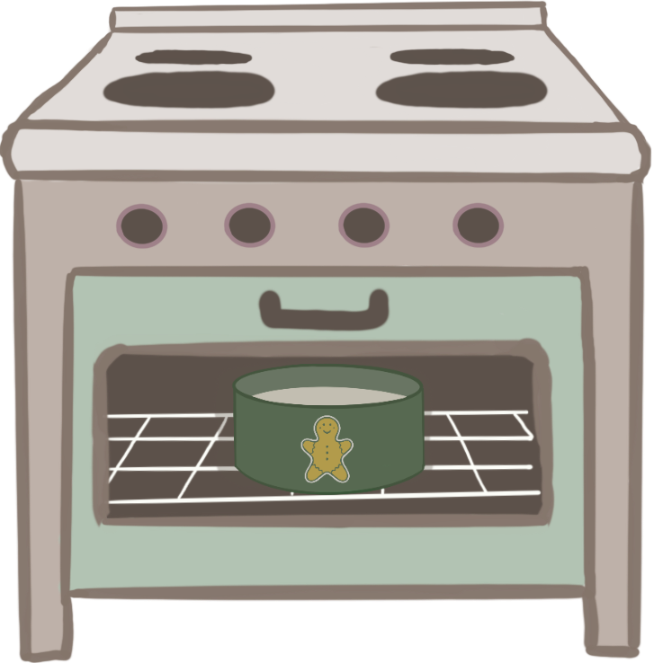

<!-- PROJECT LOGO -->
 

  

<h3 align="center">Making a Bento Cake</h3>

  

    Java application for IAT265 (Multimedia Programming) Final Proejct at SFU
  

<!-- ABOUT THE PROJECT -->

## About The Project

Video Demo
- https://youtu.be/5Ps8h7dgiOU 

This Java application guides users through a step-by-step process of baking and decorating bento cakes (aka lunchbox cakes). The application involves interactive elements such as mouse clicking, dragging, and hovering actions. Users can customize the final product, resulting in a fully baked and decorated bento cake. All graphics were made by me.

Sounds (sources):
- Button Click: https://pixabay.com/sound-effects/click-effect-86995/ 
- Background: https://pixabay.com/music/beats-empty-mind-118973/
- Open Objects: https://pixabay.com/sound-effects/open-doors-114615/
- Plate/Baking Dish: https://pixabay.com/sound-effects/plate-put-down-88789/
- Eggs: https://pixabay.com/sound-effects/egg-cracking-6844/
- Sugar/Flour.: https://pixabay.com/sound-effects/bag-of-flour-dropped-on-counter-top-80463/
- Milk.: https://pixabay.com/sound-effects/kettle-pour-into-cup-001-93575/
- Oven: https://pixabay.com/sound-effects/cookies-are-ready-95956/
- Place Icing/Decoration/Sprinkle: https://pixabay.com/sound-effects/pick-92276/
- Pick Piper: https://pixabay.com/sound-effects/item-pickup-37089/
- Pick Sprinkle: https://pixabay.com/sound-effects/phone-pick-up-46796/
- Success: https://pixabay.com/sound-effects/game-bonus-144751/

### Built With

- Primary language: Java 

<!-- CONTACT -->

## Contact

- Valeriya Ten - heyvalliet@gmail.com

Project Link: [https://github.com/lerrlera/making-bento-cake](https://github.com/lerrlera/making-bento-cake)
